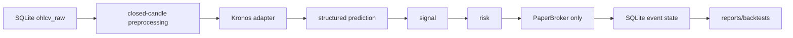

# Paper-only architecture

Raw OHLCV is immutable. Context validation rejects gaps; it never interpolates. The adapter selects CUDA only when available and allowed, otherwise CPU. It does not invent a compatibility call for unknown Kronos upstream APIs; use `--mock` only for offline deterministic tests.

## Safety
`PaperBroker` has no CCXT or exchange-order dependency. LIVE execution is not implemented. State events use deterministic IDs to prevent duplicate candle execution after restart.

## Commands
`python -m kronos_trading.cli predict --mock --db data/db/kronos_trading.db`

`python -m kronos_trading.cli backtest --mock --db data/db/kronos_trading.db`

`python scripts/setup/audit_phase2_db.py --db data/db/kronos_trading.db --days 730`
