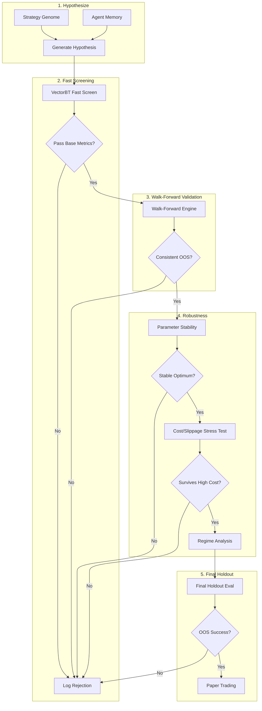

# Algo Research Lab Architecture

The objective of the Algo Research Lab is to act as an isolated, rigorous, and automated scientific laboratory for cryptocurrency strategy discovery. It prioritizes strict adherence to the scientific method, rejecting false positives through rigorous validation gates, rather than merely hunting for the highest backtest return.

## System Pipeline



## Directory Structure

```
algo-research-lab/
├── agent/                  # Automated OODA loop runner & LLM insight generator
├── strategy_genome/        # Declarative components (features, regimes, entry/exit)
├── vectorbt_engine/        # Fast vectorized screening (Stage 1)
├── freqtrade_adapter/      # Paper trading integration & live costing simulation
├── backtesting/
│   ├── walk_forward/       # Chronological walk-forward test runner
│   ├── robustness/         # Parameter perturbation, cost stress tests
│   ├── leakage/            # Automated lookahead detection 
│   └── statistics/         # Diebold-Mariano, Deflated Sharpe, Bootstrap
├── experiments/            # Auto-generated experiment configs & scripts
└── supabase/               # Schema definitions and data persistence scripts
```

## Data Split Policy
The engine enforces chronological splits across the board to prevent data leakage:
- **Research/Training**: 60%
- **Development/Validation**: 20%
- **Final Locked Holdout**: 20% (Strictly isolated until Stage 5)

## Supabase Tracking (The Lab Notebook)
Every run and hypothesis must be appended to the Supabase database.
- `research_runs`: Tracking individual agent/script executions.
- `strategy_hypotheses`: Concept logic and generated parameters.
- `backtests`: The raw output stats of a given run (OOS return, Sharpe, Calmar, turnover).
- `strategy_rejections`: Why the strategy failed (e.g., Lookahead detected, Failed cost stress, Negative OOS expectancy).
- `strategy_insights`: Agent-generated natural language learnings to guide future hypothesis generation.

## The Strategy Genome
Hypotheses are assembled from a discrete alphabet of components:
- **Base Filters**: e.g., Volume > 24h Avg
- **Regimes**: e.g., High-Volatility (defined via historical STD or external HAR model)
- **Core Signal**: e.g., Donchian Breakout, Mean Reversion Z-Score
- **Confirmation**: e.g., RSI < 30
- **Risk / Stop**: e.g., 2 ATR Trailing Stop
- **Sizing**: e.g., Risk Parity, Fixed Fractional

## Strict Protections
1. **No Lookahead**: Any `pandas` shift violations will be caught by comparing sequential predictions vs randomized row predictions.
2. **HAR Ablation**: The existing HAR model is explicitly separated and will only be tested as an overlay (Filter / Sizing) during Stage 5.
3. **No Overfitting**: Parameter fragility instantly disqualifies a candidate. The optimum must sit on a broad plateau of profitability.
